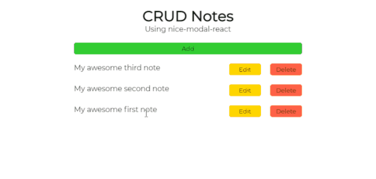

<h1 align="center">
  
   
 CRUD with React with eBay nice-modal-react
</h1>

<h3 align="justify">

</h3>
We'll explore nice-modal-react, which is a useful modal for React created by the eBay developer team building a CRUD application. Credits for LogRocket.
 

## 📷 Demonstration

<h4 align="left"></h4>
  

 

## 🚀 Technologies

This project was developed with the following technologies:

- [React](https://reactjs.org/)
- [Styled Components](https://styled-components.com/)
- [eBay nice-modal-react](https://github.com/eBay/nice-modal-react)

 

## ⚙ Commands Running
- npm start

## ⚙ Sources
- pt-br.reactjs.org

 

Made with 💜 by Rafael Maciel
